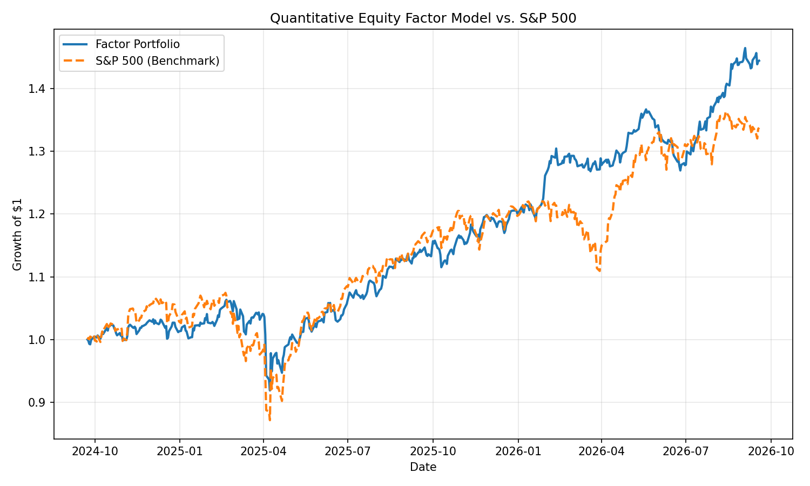
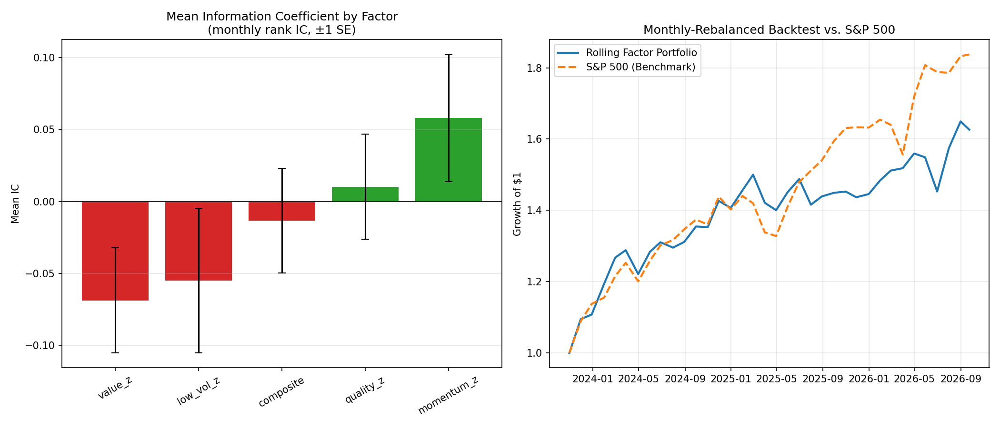

# Quantitative Equity Factor Model

A multi-factor stock ranking and portfolio construction model built in Python.
The model scores a universe of large-cap equities on four classic quantitative
factors, combines the scores into a single composite ranking, constructs a
long-only equal-weight portfolio from the top-ranked names, and backtests the
result against the S&P 500.

Companion project: [Portfolio Optimization Engine](https://github.com/henryletourneux/portfolio-optimization-engine)
takes this model's top-ranked shortlist and solves for optimal capital
allocation across it (min-variance, max-Sharpe, risk-parity) instead of
equal-weighting.

## Factors

- **Value** — earnings yield (1/P-E) and book-to-price, z-scored and combined.
- **Momentum** — 12-1 month cumulative return (excludes the most recent month
  to control for short-term reversal).
- **Quality** — return on equity, gross margin, and (inverse) debt-to-equity.
- **Low Volatility** — trailing 6-month realized volatility, inverted so
  lower risk scores higher.

Each factor is standardized (z-scored) across the universe before being
combined into a composite score using configurable weights.

## Pipeline

1. Pull adjusted price history and fundamental data for the universe via
   `yfinance`.
2. Compute the four factor scores per ticker.
3. Combine into a composite score and rank the universe.
4. Build an equal-weight portfolio from the top 30% of ranked names.
5. Backtest the portfolio against the S&P 500 (`^GSPC`) and report total
   return, annualized volatility, Sharpe ratio, and max drawdown.

## Sample Results

Backtest over a trailing 2-year window on a 40-stock large-cap universe:

| Metric | Factor Portfolio | S&P 500 |
|---|---|---|
| Total Return | 44.5% | 33.8% |
| Annualized Volatility | 12.6% | 16.1% |
| Sharpe Ratio | 1.54 | 0.99 |
| Max Drawdown | -13.6% | -18.9% |



Results are generated live from current market data and will differ on each
run — see [Notes](#notes).

## Rolling Rebalancing & Factor Information Coefficient

`rolling_analysis.py` extends the single buy-and-hold backtest above into a
**monthly rebalanced** backtest, and directly measures each factor's
predictive power via **Information Coefficient (IC)**: the cross-sectional
Spearman rank correlation between a factor's score at time *t* and each
stock's forward return to *t+1*. Momentum and Low-Volatility are recomputed
at every rebalance date from price history available up to that date only
(no look-ahead). Value and Quality are computed once from current
fundamentals and held static across the window — point-in-time historical
fundamentals aren't available from this data source, so those two legs
carry mild look-ahead bias. See [Notes](#notes).

IC summary, monthly rebalancing over a trailing 4-year window (35 periods):

| Factor | Mean IC | Std IC | Hit Rate | Information Ratio |
|---|---|---|---|---|
| Momentum | +0.058 | 0.261 | 57.1% | 0.222 |
| Quality | +0.010 | 0.217 | 57.1% | 0.047 |
| Composite | -0.013 | 0.215 | 40.0% | -0.062 |
| Low Volatility | -0.055 | 0.298 | 31.4% | -0.185 |
| Value | -0.069 | 0.216 | 40.0% | -0.318 |

Momentum is the only factor with a consistently positive, positive-IR
signal over this window; Value and Low-Volatility actually carried
*negative* predictive power, which drags the composite's IC negative even
though two of its four inputs are informative. That's a real, unflattering
result, not a cherry-picked one — see below.

Rolling backtest vs. buy-and-hold benchmark over the same 4-year window:

| Metric | Rolling Factor Portfolio | S&P 500 |
|---|---|---|
| Total Return | 62.6% | 83.8% |
| Annualized Volatility | 12.9% | 12.3% |
| Sharpe Ratio | 1.36 | 1.77 |
| Max Drawdown | -6.8% | -7.8% |



**This monthly-rebalanced version underperforms both the single buy-and-hold
backtest above and the S&P 500 over this window** — a useful, honest result:
it shows the static backtest's outperformance was sensitive to the specific
2-year window and holding-period choice, not a robust edge. That's exactly
what IC analysis is for — it isolates whether a factor has real predictive
power independent of any one lucky backtest window, and here it says the
composite, as currently weighted, doesn't. A natural next step is
IC-weighting the composite instead of using fixed 25% weights, which the
static backtest was implicitly overfitting to.

## Usage

```bash
pip install -r requirements.txt
python factor_model.py       # single buy-and-hold backtest, saves CSVs
python plot_results.py       # generates equity_curve.png
python rolling_analysis.py   # monthly rolling rebalance + IC analysis, saves CSVs
python plot_rolling.py       # generates rolling_analysis.png
```

## Notes

- This is a research/educational backtest, not investment advice. It does not
  account for transaction costs, slippage, taxes, or survivorship bias in the
  universe selection.
- Fundamental data availability varies by ticker; names missing sufficient
  data are dropped from the ranking.
- The rolling backtest holds Value and Quality static (current fundamentals
  applied across the whole window) since point-in-time historical
  fundamentals aren't available from `yfinance`. Momentum and Low-Volatility
  are recomputed at each rebalance date with no look-ahead. This means the
  Value/Quality legs of the rolling backtest and IC numbers are somewhat
  optimistic versus a fully point-in-time implementation.
- 35 monthly rebalance periods is a small sample for IC statistics — enough
  to see directional signal, not enough to treat the numbers above as
  precise.
